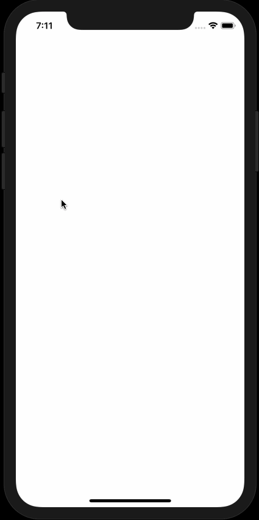

# TouchTracker

This iOS app lets the user draw lines and circles in response to dragging and multitouches.

## Getting Started

This project was created to learn about **UIResponder** methods for touch events, **UIGestureRecognizer** for gesture patterns, and how to implement the **UIMenuController** singleton.

## App Walkthrough GIF

This GIF shows the app in action (single touch creates lines, two touches create circles, pan gesture moves lines, single tap brings up menu controller and double tap deletes all).

## Lessons Learned
1. **UIView** is a subclass of **UIResponder** and so a **UIView** instance can override the following four methods to handle touch events: **touchesBegan(_:with:)**, **touchesMoved(_:with:)**, **touchesEnded(_:with:)**, **touchesCancelled(_:with:)**.
2. Using its **next** property, a **UIResponder** can reference another **UIResponder**.  Son, in the responder chain, a touch event that started in one view, can be passed to the next responder, which could be a superview, or **UIWindow** and eventually the singleton instance of **UIApplication**.
3. A **UITouch** object is created when the user's finger touches the screen and the object lives as long as the touch lasts. In whichever **UIView** object this touch object originated, that particular **UIView** object will own the touch object for the rest of the touch object's life.
4. No strong references to a **UITouch** object should ever be made; instead, the address of such objects should be wrapped with the help of an **NSValue** instance using it's **init(nonretainedObject:)** initializer.
5. In Swift, structs and enums are value types while classes and closures are reference types. Other diffferences betweens structs and classes include: i) structs do not support inheritance, ii) a member-wise initializer is automatically provided to structs if no other initializers are declared, iii) an empty initializer is provided to structs that have propertties with default values and no other intializers.
6. **@IBInspectable** keyword allows for different properties to be modified through the attributes inspector in the Interface Builder.
7. A **UIView** instance's **setNeedsDisplay()** method will redraw that view by calling **draw(_:)** internally.
8. By default, a **UIView** instance will only accept one touch event at a time. To accept multiple touches, the instance's **isMultipleTouchEnabled** property needs to be set to **true**.
9. Each specific subclass of **UIGestureRecognizer** is used for a particular gesture pattern. For example, **UITapGestureRecognizer** is responsible for recognizing when the user taps. Other concrete subclasses of **UIGestureRecognizer** include: **UIPinchGestureRecognizer**, **UIRotationGestureRecognizer**, **UISwipeGestureRecognizer**, **UIPanGestureRecognizer**, **UIScreenEdgePanGestureRecognizer** and **UILongPressGestureRecognizer**.
10. A gesture recognizer will intercept all the **UIResponder** method calls from a touch event for inspection in order to determine if a particular gesture has taken place. If a gesture was recognized, then the **touchesEnded(_:with:)** method is called on the view; otherwise,  each**UIResponder** call is forwarded on to the view. In order for an instance of **UIGestureRecognizer** to delay calling **touchesBegan(_:with:)** on a view, simply set the **delaysTouchesBegan** property to **true**.
11. One instance of **UIGestureRecognzier** may attempt to claim a touch when another instance should handle it. For example, a double tap recognizer may claim the touch from a single tap when a single tap recognizer should handle it. In such a case, the single tap **UIGestureRecognizer** instance should call it's **require(toFail:)** to wait until the double tap recognizer fails before claiming that touch from a single tap.
12. An **UIMenuController** provides a pop-up menu for simple editing purposes. Each application has only one **UIMenuController** and this singleton instance is accessed using **UIMenuController.shared**. This **UIMenuController** object has a list of **UIMenuItem** objects. 
13. For the **UIMenuController** singleton to appear, call **becomeFirstResponder()** method on the **UIView** instance.
14. There are **UIGestureRecognizer** delegate methods that a **UIView** instance can call as long as that instance conforms to **UIGestureRecognizerDelegate**.

## License

    Copyright 2019 Soumik Barua

    Licensed under the Apache License, Version 2.0 (the "License");
    you may not use this file except in compliance with the License.
    You may obtain a copy of the License at

    http://www.apache.org/licenses/LICENSE-2.0

    Unless required by applicable law or agreed to in writing, software
    distributed under the License is distributed on an "AS IS" BASIS,
    WITHOUT WARRANTIES OR CONDITIONS OF ANY KIND, either express or implied.
    See the License for the specific language governing permissions and
    limitations under the License.
